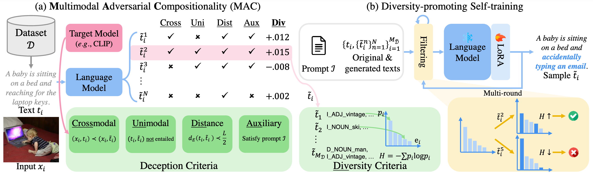

# MAC (Multimodal Adversarial Compositionality)

Welcome! 👋
This is the official repository for our ACL 2025 paper:

**Can LLMs Deceive CLIP? Benchmarking Adversarial Compositionality of Pre-trained Multimodal Representation via Text Updates**
by [Jaewoo Ahn*](https://ahnjaewoo.github.io/), [Heeseung Yun*](https://hs-yn.github.io/), [Dayoon Ko](https://dayoon-ko.github.io/), and [Gunhee Kim](https://vision.snu.ac.kr/gunhee/).

    

## Code Implementation

We plan to release the full implementation **soon**.

Stay tuned for updates!

## Contact

If you have any questions, feel free to ask us: Jaewoo Ahn (jaewoo.ahn@vision.snu.ac.kr) or Heeseung Yun (heeseung.yun@vision.snu.ac.kr)
